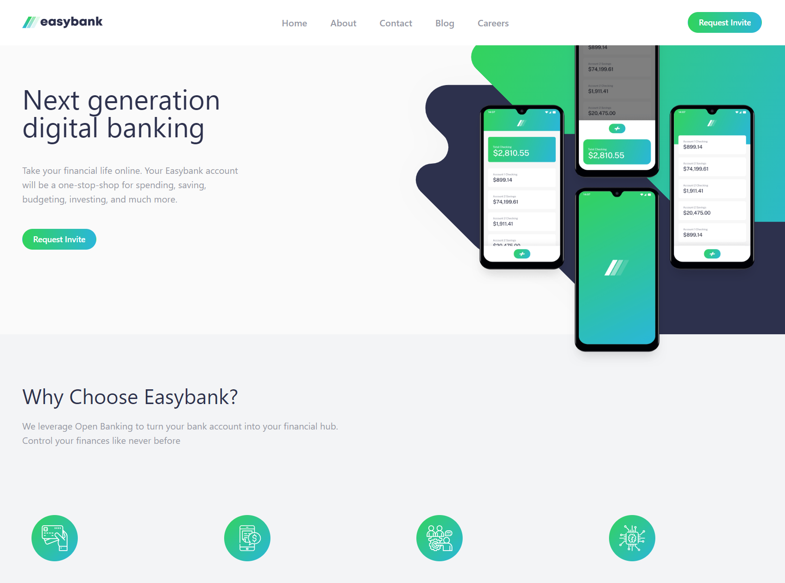

# Frontend Mentor - Results summary component solution

This is a solution to the [Easybank landing page challenge on Frontend Mentor](https://www.frontendmentor.io/challenges/easybank-landing-page-WaUhkoDN). Frontend Mentor challenges help you improve your coding skills by building realistic projects.

## Table of contents

-   [Overview](#overview)
    -   [The challenge](#the-challenge)
    -   [Screenshot](#screenshot)
    -   [Links](#links)
-   [My process](#my-process)
    -   [Built with](#built-with)
    -   [What I learned](#what-i-learned)
    -   [Continued development](#continued-development)
    -   [Useful resources](#useful-resources)

## Overview

### The challenge

This challenge will provide a nice test for your layout skills. If you're ready to move up from Junior challenges, this one is a great next step.

Users should be able to:

-   View the optimal layout for the interface depending on their device's screen size
-   See hover and focus states for all interactive elements on the page

### Screenshot

### Links

-   Solution URL: https://www.frontendmentor.io/solutions/responsive-landing-page-built-with-mantine-ui-library-components-NOly1L_D19
-   Live Site URL: https://dlee1993.github.io/FEM-rest-api/

## My process

This layout is fairly simple, most of the layout can be cmopleted by using flex-col and flex-row based on screen size, the difficult part is to have the image sized correctly for each screen width and to allow them to overlap into the sibling section.

### Built with

-   Semantic HTML5 markup
-   Tailwind css
-   Mantine UI library
-   Mobile-first workflow
-   [React](https://reactjs.org/) - JS library

### What I learned

I learned how to utilise a third party ui library to create components for the landing page

### Continued development

I am going to continue using tailwind and explore Mantine UI library in more depth

### Useful resources

-   Tailwindcss Docs (https://www.tailwindcss.com)
-   Mantine UI Library (https://mantine.dev/)

## Author

-   Frontend Mentor - https://www.frontendmentor.io/profile/DLee1993
